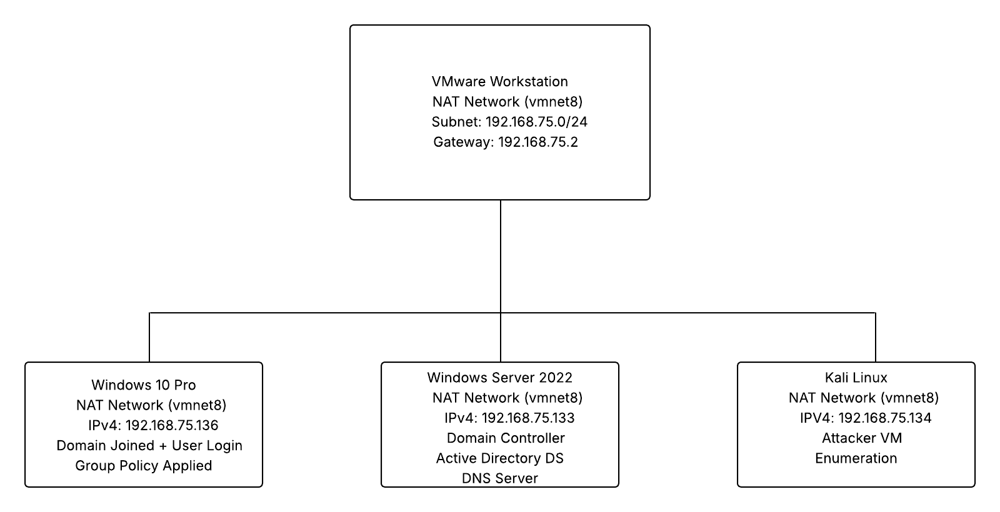

# Active-Directory-Homelab

## Network Overview

This lab uses a single NAT network inside VMware Workstation.
All machines share the same subnet 192.168.75.0/24.

## 🛡️ Active Directory Home Lab for Red Teaming + IT Help Desk Skills

This project documents the creation of a full Active Directory enterprise environment built using VMware Workstation Pro, Windows Server 2022, Windows 10, and Kali Linux.

The goal was to simulate a real corporate domain environment to learn:

• Windows Server administration

• Active Directory & Group Policy 

• User & computer management

• DNS and DHCP

• Networking fundamentals

• Red team attack techniques

• Blue team analysis and detection

## 🏗️ Virtual Lab Architecture

My Hypervisor: VMware Workstation Pro
Network: NAT (vmnet8)
Domain Name: homelb.local

| Machine        | OS           | IP Address  | Role  |
| ------------- |:-------------:| :-----:| -----:|
| Wiindows-Server-2022 | Windows Server 2022 | 192.168.75.133 | Domain Controller, DNS server|
| Windows-10-Server     | Windows 10 Home |   192.168.75.136 | Domain Joined Client, User|
| Kali-Linux | Kali Linux  |192.168.75.134| Attacker VM|

## Network Explanation

This network involved me utilizing VMware Workstation pro, configured on a NAT (private network on a single IP address), which was a hypervisor (virtualization software that creates and runs Virtual Machines) for my virtual machines on said private network. My goal was to learn how to use Microsoft Active Directory and to familiarize myself with it, alongside onboarding users and creating my own simulated corporate environment. I also took it a step further by introducing an attacker machine, to not only learn how active directory domain services work, but also how to exdploit vulnerabilities within active directory domain services. This involved setting up my windows 2022 server as the domain controller and dns server for my windows 10 machine, and then configure my kali linux attacker VM to be able to see said local network. 

## Draft overlay

Overview/

VM list/

Network explanation/

Step-by-step setup/

Learning objectives/

Commands used/

Attack paths (optional)/

Screenshots layout/
